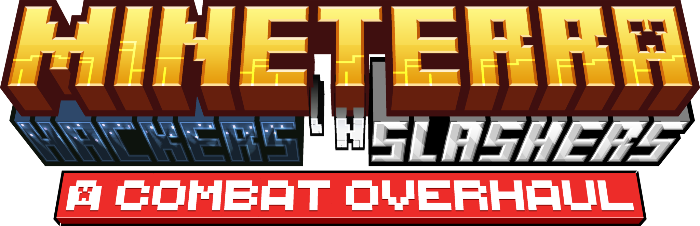

  

## Welcome to my mod repository :D

**Hackers 'n Slashers** is a simple and fun Minecraft mod that reimagines combat strategies and mechanics, rework critical hits and refactors the overall combat logic to make the game more engaging and dynamic.

## 🚀 Next Goals
I'm actively working on:
- Adding configuration files for enhanced customization.
- Implementation of weapon type based parry animations.
- Custom behavior for mobs reacting to stealthy players.
- Introducing features to support mod developers.

  Made with ❤ and ☕.

