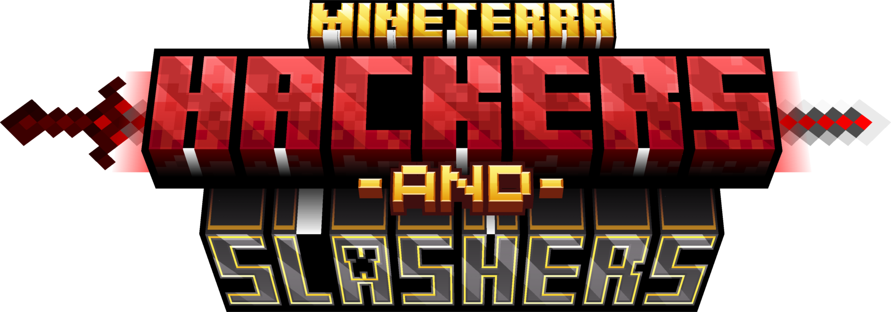

#### Hey! welcome to my project :D
This is a mod that adds new simple mechanics for Minecraft combat, and an overhaul]
in the critical system, bringing more strategy and dynamic gameplay!

---

## ✨ Features

---

### 🗡️ Improved critical system

Critical system has been significantly improved. The vanilla critical has been
replaced by two critical types based on new mechanics added by the mod, all based on
RPG games.

#### **BACKSTAB**

To take advantage of the stealth system implemented in the mod, a critical hit based on
detection was added. Basically, if you are undetected and attack a mob, you will deal an
explosive amount of damage with a multiplier of `3x damage`, that increases slightly when using
weapons that has a higher attack speed.

_Against players, the backstab can be activated while invisible or while out of its field of view._

